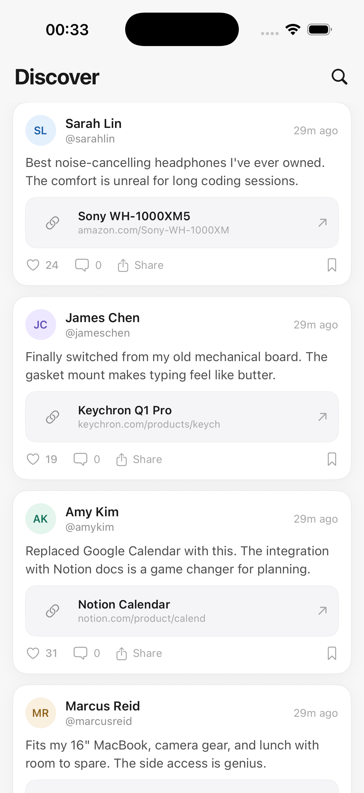
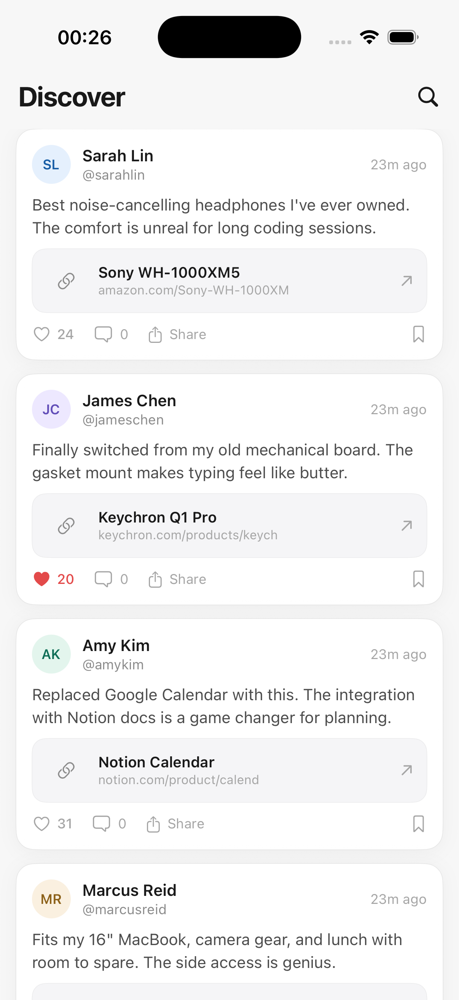

# Product Recommendation Feed

A full-stack product recommendation feed built with **NestJS + MongoDB** (backend) and **SwiftUI** (iOS).

## Screenshots

| Feed | Like interaction |
|------|-----------------|
|  |  |

## Architecture

```
┌──────────────┐         ┌──────────────┐         ┌──────────┐
│   SwiftUI    │  HTTP   │   NestJS     │  Mongo  │ MongoDB  │
│   iOS App    │ ──────> │   REST API   │ ──────> │  Server  │
└──────────────┘         └──────────────┘         └──────────┘
```

### Backend (NestJS + TypeScript + MongoDB)

- **Recommendation schema** with `username`, `productName`, `productUrl`, `caption`, `likes`, `createdAt`
- Input validation via `class-validator` (URL format, 280-char caption limit)
- Atomic `$inc` for like increments (concurrency-safe)
- Proper NestJS structure: module → controller → service → DTO → schema

### iOS (SwiftUI)

- Light-themed feed with card-based layout inspired by [Trndzy](https://www.trndzy.app)
- Optimistic UI updates with automatic rollback on failure
- Relative timestamps ("3h ago", "2d ago")
- Embedded product link previews
- Component-based architecture (`RecommendationCard`, `ProductLinkPreview`, `ActionBar`)

## Prerequisites

- **Node.js** ≥ 18
- **MongoDB** running locally on port 27017
- **Xcode** ≥ 15 (for the iOS app)

## Getting Started

### 1. Install MongoDB (macOS)

```bash
brew tap mongodb/brew
brew install mongodb-community
brew services start mongodb-community
```

Verify:

```bash
mongosh --eval "db.runCommand({ ping: 1 })"
# Should return: { ok: 1 }
```

### 2. Run the Backend

```bash
cd recommendation-api

# Install dependencies
npm install

# Seed the database with sample data
npm run seed

# Start the dev server (hot reload)
npm run start:dev
```

The API runs at **http://localhost:3000**.

### 3. Run the iOS App

1. Open `RecommendationFeed/RecommendationFeed.xcodeproj` in Xcode
2. Ensure the backend is running
3. Select an iPhone simulator
4. Press `Cmd + R` to build and run

> **Note:** The iOS app connects to `http://localhost:3000`. The project's Info.plist has `App Transport Security → Allow Arbitrary Loads = YES` to permit HTTP in development. For production, use HTTPS.

## API Endpoints

### `POST /recommendations`

Create a new recommendation.

```bash
curl -X POST http://localhost:3000/recommendations \
  -H "Content-Type: application/json" \
  -d '{
    "username": "Sarah Lin",
    "productName": "Sony WH-1000XM5",
    "productUrl": "https://www.amazon.com/dp/B09XS7JWHH",
    "caption": "Best noise-cancelling headphones ever."
  }'
```

**Validation:**
- `username` — required, non-empty string
- `productName` — required, non-empty string
- `productUrl` — required, must be a valid URL
- `caption` — required, max 280 characters

Invalid input returns `400 Bad Request` with specific error messages.

### `GET /recommendations`

Returns all recommendations sorted by most recent first.

```bash
curl http://localhost:3000/recommendations
```

### `PATCH /recommendations/:id/like`

Atomically increments the like count by 1.

```bash
curl -X PATCH http://localhost:3000/recommendations/<id>/like
```

Returns `404 Not Found` if the ID doesn't exist.

## Project Structure

```
├── recommendation-api/             # Backend
│   ├── src/
│   │   ├── main.ts                 # Bootstrap, ValidationPipe, CORS
│   │   ├── app.module.ts           # Root module (Mongoose connection)
│   │   ├── seed.ts                 # Database seed script
│   │   └── recommendations/
│   │       ├── recommendations.module.ts
│   │       ├── recommendations.controller.ts
│   │       ├── recommendations.service.ts
│   │       ├── dto/
│   │       │   └── create-recommendation.dto.ts
│   │       └── schemas/
│   │           └── recommendation.schema.ts
│   ├── package.json
│   └── tsconfig.json
│
└── RecommendationFeed/             # iOS App
    └── RecommendationFeed/
        ├── RecommendationFeedApp.swift
        └── ContentView.swift
```

## Design Decisions

- **Optimistic UI**: Like count updates instantly on tap, rolls back if the API call fails. This makes the app feel responsive.
- **Atomic `$inc`**: Uses MongoDB's `$inc` operator instead of read-then-write to prevent race conditions when multiple users like simultaneously.
- **Component extraction**: `ProductLinkPreview` and `ActionBar` are separate SwiftUI views for reusability and readability.
- **Dark-first theme**: Designed to match Trndzy's product aesthetic — white cards with subtle shadows on a soft gray background.
- **UI placeholders**: Comment, share, and bookmark icons are visual placeholders to demonstrate card design intent. Only the like button is connected to the backend, as specified in the requirements.
